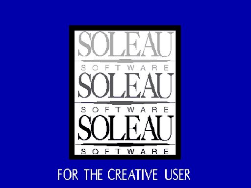
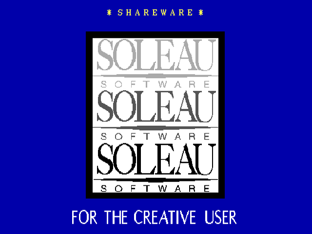
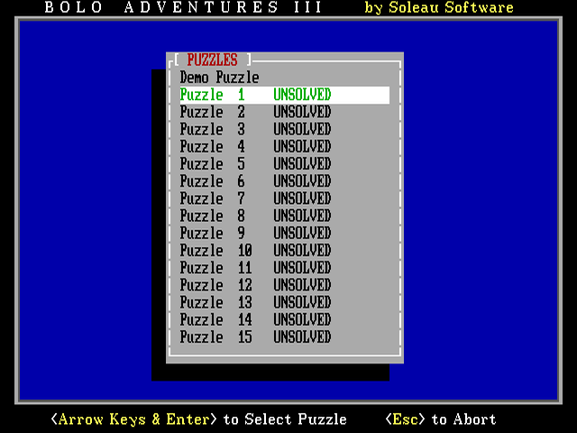
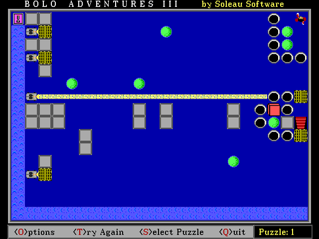

<div align="center">

# 🟡 BOLO — a static recomp of *Bolo Adventures III*

```
   ___  ___  _    ___    _   ___ _   _____ _  _ _____ _   _ ___ ___ ___   ___ ___ ___
  | _ )/ _ \| |  / _ \  /_\ |   \ \ / / __| \| |_   _| | | | _ \ __/ __| |_ _|_ _|_ _|
  | _ \ (_) | |_| (_) |/ _ \| |) \ V /| _|| .` | | | | |_| |   / _|\__ \  | | | | | |
  |___/\___/|____\___//_/ \_\___/ \_/ |___|_|\_| |_|  \___/|_|_\___|___/ |___|___|___|

         Mr. Bolo is trapped in 15 rooms of lasers, crates and water.
              Let's get him out — on hardware that didn't exist in 1993.
```

**Soleau Software, 1993 → native code, today.**
No DOSBox. No emulator. The original 16-bit DOS binary, taken apart and rebuilt.



<sub>The game's own demo puzzle, running as recompiled native code — Mr. Bolo
rolling balls into the water and parking crates in front of lasers on his way
to the red stairs.</sub>

</div>

---

## What is this?

*Bolo Adventures III* is a 1993 EGA/VGA shareware puzzle game by William Soleau —
a grid-based logic game in the Sokoban lineage. You push boxes, roll balls into
holes, float crates across water, and block lasers to guide **Mr. Bolo** to the
red stairs through 15 increasingly devious rooms. It rewards thinking, not
reflexes, and a certain kind of kid (👋) lost whole afternoons to it.

It's also wonderfully *small* — a single 80 KB executable and a handful of data
files — which makes it a perfect candidate for a **static recompilation**: not
emulating the game, but reverse-engineering the original 8086 machine code and
lifting it back into C that compiles and runs natively on a modern machine.

This repo is that effort, done with the [pcrecomp toolkit](../tools) — the same
pipeline that resurrected *Civilization* (1991) from 16-bit DOS.

## Why bother?

Because emulation runs old games; recompilation *frees* them. The output is
native code you can read, debug, fix, and extend — widescreen, save states, a
level editor, new puzzle packs — things the original could never do. And because
some games deserve to outlive their floppy disks.

> *"We're not reverse engineers. We're software archaeologists. And the dig site
> is every hard drive from the 90s."*

## How it works (the short version)

```
  BOLO3.EXE (PKLITE-packed 16-bit DOS)
        │  ① unpack         tools/unpklite.py
        ▼
  clean MZ image
        │  ② decode         decode16.py   (8086 → instructions)
        │  ③ analyze        analyze.py    (functions, call graph, strings)
        ▼
  symbol table
        │  ④ lift           lift16.py     (8086 → C, against a DOS/VGA runtime)
        ▼
  C source  ──⑤ shim──▶  EGA→SDL2, DOS INTs→runtime  ──⑥ build──▶  native BOLO
```

The `.OV0`–`.OV4` and `.JFT` files alongside the exe look like code overlays but
are actually the game's **data** — EGA tile/sprite graphics, menu text, and the 15
puzzle layouts. Reversing those formats happens in parallel (see
[`docs/FORMATS.md`](docs/FORMATS.md)).

## Status

🎮 **It's playable.** The recompiled binary boots the way the original does —
Soleau splash, title, puzzle list — and you can pick a puzzle and walk Mr. Bolo
around it, with the original PC-speaker sound effects, entirely as native code.

| Boot | Pick a puzzle | Play |
|:---:|:---:|:---:|
|  |  |  |

What it took, in short: a DOS memory call QB *expects to fail*, an 8087
emulator the program ships inside itself, QuickBASIC's `ON…GOSUB` tables and
self-overlapping instructions, and an EGA card faithful enough for QB's
read-mode and latch tricks. The blow-by-blow is in [`docs/NEXT.md`](docs/NEXT.md).

### How we got here

🚧 **Phase 1 done — the patient is unpacked and on the table.**

- ✅ **Unpacked the PKLITE compression ourselves.** BOLO3.EXE uses PKLITE 1.15 in
  its trickiest *large + extra* mode with a *self-decrypting* stub. We reverse-
  engineered the stub, wrote a byte-exact static decompressor
  ([`tools/unpklite.py`](tools/unpklite.py) — a new reusable toolkit tool), and
  recovered the full **136 KB** load image. No emulator required.
- ✅ **Analyzed:** 182 functions, ~35K instructions, 833 strings.
- ⭐ **Identified the language: compiled Microsoft QuickBASIC 4.5.** The runtime
  error-message table (`RETURN without GOSUB`, `CASE ELSE expected`, …) gives it
  away. That means much of the binary is the *known* QB runtime, and the graphics
  are BASIC `SCREEN 9` EGA `PUT`/`GET` sprites — a big head start on the rest.
- ✅ **Classified (Phase 2):** the call graph shows **81% of calls go into the QB
  runtime** — leaving only **~70 functions of actual Bolo game logic** to reverse.
  The interrupt/shim surface is small and mapped (DOS, EGA, keyboard, mouse, timer,
  FP emulator). See [`docs/CLASSIFY.md`](docs/CLASSIFY.md).
- 🔨 **Lifting (Phase 3):** the game is mechanically lifted to C
  ([`tools/lift_bolo.py`](tools/lift_bolo.py) → `src/recomp/gen/`) against the
  `recomp16` runtime, with a build skeleton (`CMakeLists.txt`, `src/main.c`).
  Segment-aware discovery resolves the call graph: **932 functions, 56.8K
  instructions, 70K lines of C**, with **99% of near calls resolved to real
  function starts** and only 14 stubs left (all out-of-image BIOS/absolute
  targets). The program entry is lifted. Remaining gaps are the classic hard
  parts: x87 FPU translation and indirect-dispatch wiring. Compiling needs
  MSVC + SDL2 (not available in this environment yet).

| Phase | What | State |
|------:|------|-------|
| 0 | Reconnaissance | ✅ [`docs/RECON.md`](docs/RECON.md) |
| 1 | Unpack PKLITE + disassemble | ✅ |
| 2 | Classify QB runtime vs game logic | ✅ [`docs/CLASSIFY.md`](docs/CLASSIFY.md) |
| 3 | Lift 8086 → C | ✅ 932 funcs / 70K lines, call graph resolved |
| 4 | Shim EGA/DOS → SDL2 | ✅ recomp16 runtime wired |
| 5 | Build & debug to playable | ✅ **boots to the menu, puzzles load and play** |
| 6 | Ship native + extras | ⬜ |

See [`docs/PLAN.md`](docs/PLAN.md) for the full roadmap and milestones.

## Repo layout

```
bolo/
  original/     The original 1993 shareware files (the ground truth)
  docs/         RECON.md · PLAN.md · FORMATS.md
  tools/        Project-specific tools (PKLITE unpacker, asset extractors)
  work/         Scratch / regeneratable analysis output (gitignored)
  src/          Recompiled + hand-written runtime code (later phases)
```

## Building & running

With MSYS2 mingw64 (gcc + SDL2) and Python (`unicorn`, `capstone`):

```bash
# 1. post-startup snapshot (PKLITE + QB startup, run once in a Unicorn harness)
python tools/uni_original.py
# 2. lift the program from the snapshot  (needs the pcrecomp toolkit: PCRECOMP_HOME)
python tools/lift_bolo.py
# 3. build (parallel, ~10 min)
bash scripts/build.sh
# 4. play
PATH=/c/msys64/mingw64/bin:$PATH ./build/bolo.exe work/snapshot.bin
```

**Controls** are the original game's: `S` select puzzle, arrows + Enter in the
list, arrows to move Mr. Bolo, `T` try again, `Q` quit. The game reads and
writes `BOLO3.SCR` (its solved-puzzle record) next to its data files in
`original/`.

Handy switches: `BOLO_SHOT=N` saves the screen to `work/shot_NNN.bmp` every N
seconds; `BOLO_KEYS="..."` scripts the keyboard for headless runs (`^U/^D/^L/^R`
arrows, `~` = 150 ms pause, trailing `$` = stop); `SDL_VIDEODRIVER=dummy` runs
without a window; `BOLO_TRACE=1` logs every function entry for diffing against
`tools/uni_original.py --enter-trace`.

## About the author

*Bolo Adventures III* is the work of **William Soleau**, who ran Soleau Software
as a one-man shop out of 163 Amsterdam Avenue in New York — the address is still
on the game's registration form — and put out
[some 57 DOS games](https://www.classicdosgames.com/company/soleau.html) of
logic puzzles and gentle arcade fare through the 1990s and early 2000s. The
Soleau Software site now reads simply *"Thank-you for 30 years."*

Games were only half of it. By all accounts the same William Soleau — the
Amherst graduate of the Soleau Software bio — is a ballet dancer turned
choreographer: a former principal dancer who
[performed in over 30 countries](http://www.balletdances.com/resume.html),
worked with Alvin Ailey, John Butler and Antony Tudor, and has made more than
100 ballets for companies around the world, from the Shanghai Ballet to Ballet
Austin. Since 2018 he has been
[co-artistic director of State Street Ballet](https://statestreetballet.com/william-soleau)
in Santa Barbara. Somewhere between rehearsals, Mr. Bolo got his lasers and his
water. Thank you, Mr. Soleau.

## Credits & legal

Original game © 1993 **William Soleau / Soleau Software**, distributed as
shareware. This is a personal preservation / reverse-engineering project of a
long-abandoned title; all reverse-engineered code here is original work produced
by analyzing the freely-distributable shareware binary. The unmodified shareware
package is included in [`original/`](original/) — the game's own terms say it
"may be passed along to your friends or local BBS" — because it's tiny and it is
the reference for the recompilation. Those files remain © Soleau Software under
their original shareware terms; the repo's MIT license covers only the code and
tools written here. If you enjoyed Bolo, go say thanks to Soleau Software.

Built with the [pcrecomp toolkit](../tools) and far too much nostalgia.
